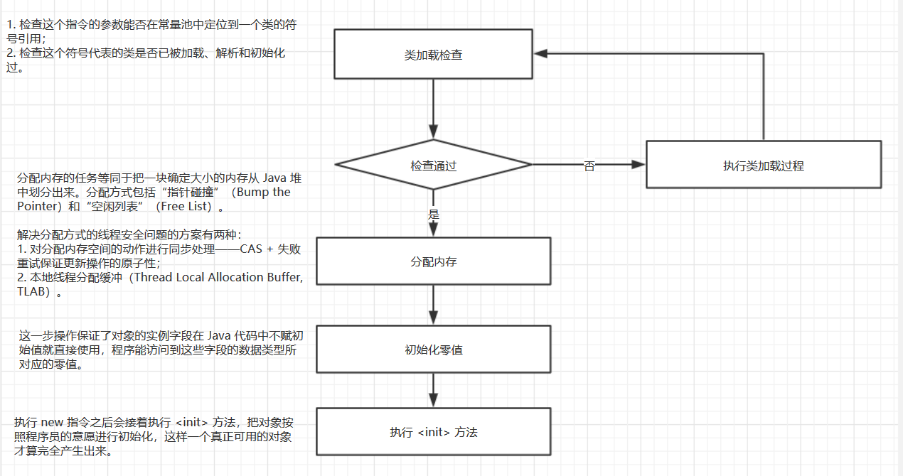
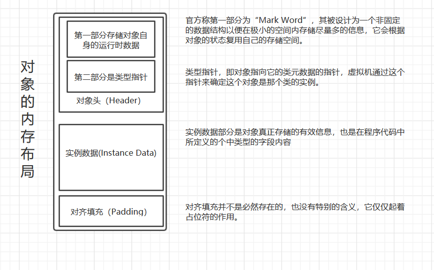
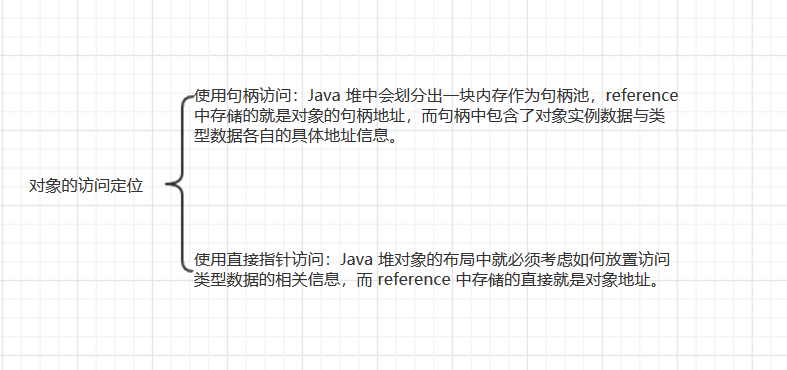
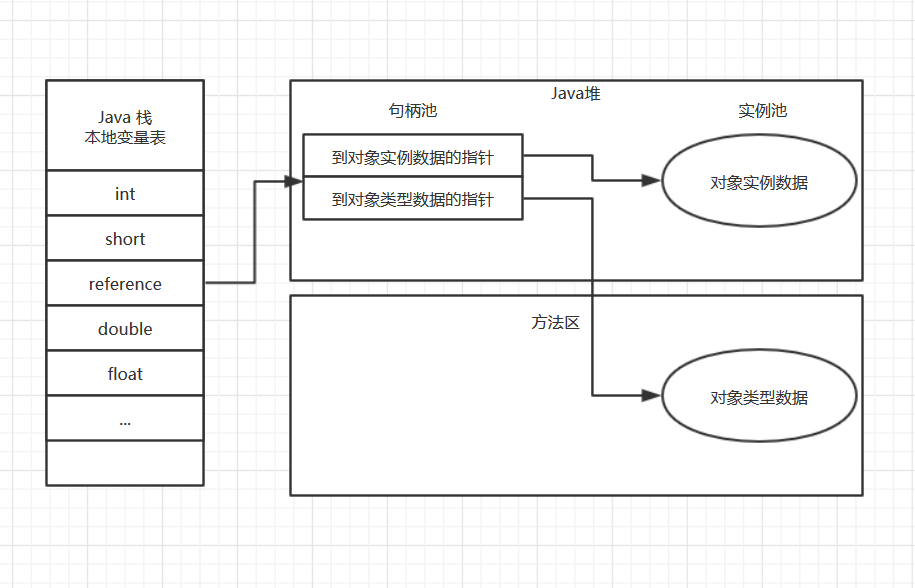
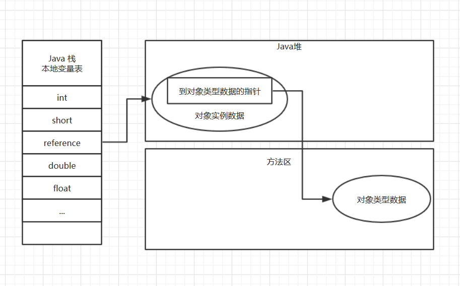

## 《深入理解Java虚拟机》（二）：对象的创建

> ==============
>
> ### 读书笔记系列
>
> ==============

图1 对象的创建流程

图1 对象的内存布局

图1 对象的访问定位

系列上一篇介绍了运行时数据区之后，我们大致知道了虚拟机内存的概况。本篇呢，就大概介绍一下关于内存的使用——对象的创建。上面的图片为本章内容的总结，想要节省时间的同学只需了解图片内容即可。

### 1. 对象的创建过程

众所周知，Java 是一门面向对象的编程语言，没有对象怎么办？`new` 一个就好啦！在语言层面上，创建对象（例如克隆、反序列化）通常仅仅是一个 `new` 关键字而已，而在虚拟机中，对象的创建又是怎样的过程呢？

虚拟机遇到一条 `new` 指令时，**首先进行类加载检查**。检查这个指令的参数能否在常量池中定位到一个类的符号引用，并且检查这个符号引用代表的类是否已被加载、解析和初始化过，如果没有，那必须先执行相应的**类加载过程**（之后的系列文章会介绍到）。

接下来虚拟机将为新生的对象**分配内存**。对象所需内存的大小在类加载完成后便可完全确定，为对象分配空间的任务等同于把一块确定大小的内存从 Java 堆中划分出来。假设 Java 堆中内存是绝对规整的，所有用过的内存的都放在一边，空闲的内存都放在一边，中间放着一个指针作为分界点的指示器，那所分配的内存就仅仅是把那个指针向空闲空间那边移动一段与对象大小相等的距离，这种分配方式称为 **“指针碰撞”（Bump the Pointer）**。如果 Java 堆是不规整的，已使用的内存和空闲的内存相互交错，虚拟机就必须维护一个列表，记录哪些内存块是可用的，在分配的时候从列表中找到一块足够大的空间划分给对象实例，并更新列表上的记录，这种分配方式称为 **“空闲列表”（Free List）**。另外一个需要考虑的问题是，对象创建在虚拟机中是非常频繁的行为，即使是仅仅修改指针所指向的位置，在并发情况下也不是线程安全的，可能出现正在给对象 A 分配内存，指针还没来得及修改，对象 B 又同时使用了原先的指针来分配内存的情况。解决方案有两种：一种是对分配内存空间的动作进行同步处理——实际上虚拟机采用 **CAS 配上失败重试的方法保证更新操作的原子性**；另一种是把内存分配的动作按照线程划分在不同空间之中进行，即每个线程在 Java 堆中预先分配一小块内存，称为**本地线程分配缓冲（Thread Local Allocation Buffer，TLAB）**。哪个线程需要分配内存，就在哪个线程的 TLAB 上分配，只有 TLAB 用完并分配新的 TLAB 时，才需要同步锁定。

内存分配完成后，虚拟机需要将分配到的内存空间都**初始化为零值**（不包括对象头）。如果使用 TLAB ，这一工作过程也可以提前至 TLAB 分配时进行。这一步操作保证了对象的实例字段在 Java 代码中可以不赋初始值就直接使用，程序能访问到这些字段的数据类型所对应的零值。接下来，虚拟机要对对象进行必要的设置，例如对象是哪个类的实例、如何才能找到类的元数据信息、对象的哈希码、对象的 GC 分代年龄等信息。

在上面的工作都完成之后，从虚拟机的视角来看，一个新的对象已经产生了，但从 Java 程序的视角来看，对象创建才刚刚开始——`<init>` 方法还没有执行，所有的字段都还为零。所以，一般来说，执行 `new` 指令之后会接着 **执行 `<init>` 方法**，把对象按照程序员的意愿进行初始化，这样一个真正可用的对象才算完全产生出来。

### 2. 对象的内存布局

> *注：以下虚拟机均是指 HotSpot 虚拟机。*

在虚拟机中，对象在内存中存储的布局可以分为 3 块区域：**对象头（Header）**、**实例数据（Instance Data）**和**对齐填充（Padding）**。

虚拟机的对象头包括两部分信息：第一部分**用于存储对象自身的运行时数据**，如哈希码（HashCode）、GC 分代年龄、锁状态标志、线程持有的锁、偏向线程 ID、偏向时间戳等，这部分数据的长度在 32 位和 64 位虚拟机（未开启压缩指针）中分别为 `32bit` 和 `64bit`，官方称它为 “Mark Word”；另一部分是**类型指针**，即对象指向它的类元数据的指针，虚拟机通过这个指针来确定这个对象是哪个类的实例。

**实例数据部分是对象真正存储的有效信息**，也是在程序代码中所定义的各种类型字段。无论是从父类中继承的，还是在子类中定义的，都需要记录下来。其存储顺序会收到虚拟机分配策略参数（`FieldAllocationStyle`）和字段在 Java 源码中定义顺序的影响。HotSpot 虚拟机默认的分配策略为 `longs/doubles`、`ints`、`shorts/chars`、`bytes/booleans`、`oops（Ordinary Object Pointers）`，从分配策略中可以看出，相同宽度的字段总是被分配到一起。在满足这个前提条件的情况下，在父类中定义的变量会出现在子类之前。如果 `CompactFields` 参数值为 `true`（默认为 `true`），那么子类中较窄的变量也可能会插入到父类变量的空隙之中。

第三部分**对齐填充并不是必然存在的**，也没有特别的含义，它仅仅起着占位符的作用。由于虚拟机的自动内存管理系统要求对象起始地址必须 8 字节的整数倍，换句话说，就是对象的大小必须是 8 字节的整数倍。而对象头部分正好是 8 字节的倍数，因此，当对象实例数据部分没有对齐时，就需要通过对齐填充来补全。

### 3. 对象的访问定位

建立对象是为了使用对象，Java 程序需要通过栈上的 `reference` 数据来操作堆上的具体对象。由于 `reference` 类型在 Java 虚拟机规范中只规定了一个指向对象的**引用**，所以对象的访问方式也是取决于虚拟机实现而定的，目前主流的访问方式有 **使用句柄** 和 **直接指针** 两种。

- 使用句柄访问的话，那么 Java 堆中将会划分出一块内存来作为句柄池，`refenerce` 中存储的就是对象的句柄地址，而句柄中包含了对象实例数据与类型数据各自的具体地址。

- 使用直接指针访问，那么 Java 堆对象的布局中就必须考虑如何防止访问类型数据的相关信息，而 `reference` 中存储的直接就是对象地址。

这两种对象访问方式各有优势，使用句柄来访问的最大好处是 `reference` 中存储的是稳定的句柄地址，在对象被移动（垃圾收集时移动对象是非常普遍的行为）是只会改变句柄中的实例数据指针，而 `reference` 本身不需要修改。

使用直接指针访问方式的最大好处就是访问速度快，它节省了一次指针定位的时间开销，由于对象的访问在 Java 中非常频繁，因此这类开销积少成多后也是一项非常可观的执行成本。

### 总结

以上便是本篇笔记的内容了，我们这里了解到了**对象的创建流程**，**对象的内存布局**，以及**对象的访问定位**。