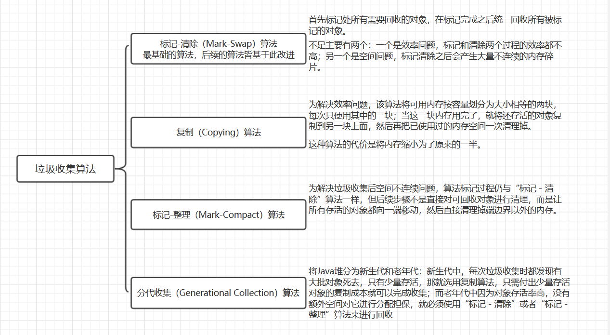
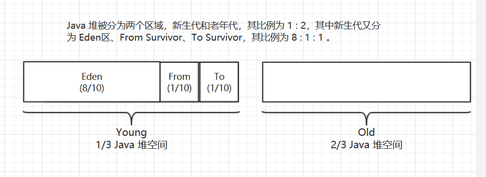
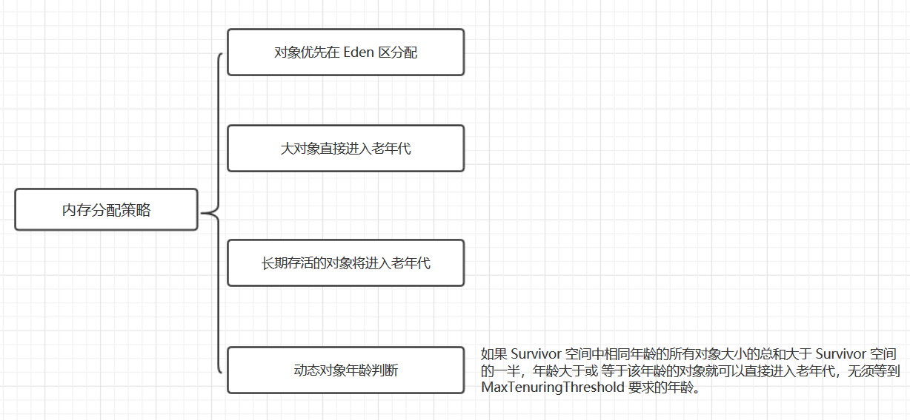
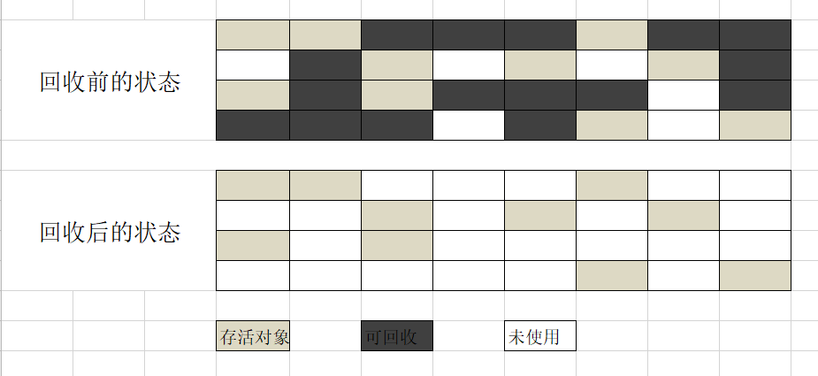
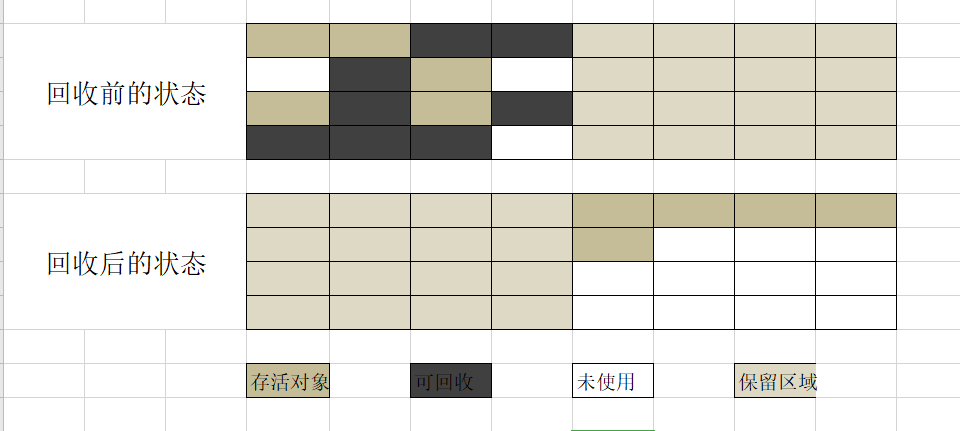
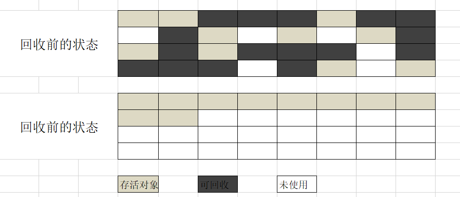

## 《深入理解Java虚拟机》（四）：垃圾收集算法以及内存分配策略

> ==============
>
> ### 读书笔记系列
>
> ==============

接下来我们就要聊到最常见的问题了，垃圾收集算法，以及内存分配策略。



图1. 常见的垃圾收集算法



图2. Java 堆的分区及其比例



图3. 内存分配策略

### 垃圾收集算法

#### 1. 标记 - 清除算法

“标记-清除”（Mark-Swap）算法是最基础的收集算法，后续的收集算法都是基于这种思路并对其不足进行改进而来的。顾名思义，算法分为“标记”和“清除”两个阶段：首先标记处所有需要回收的对象，即“死去”的对象，在标记完成之后统一回收所有被标记的对象。它的不足主要有两个：一个是效率问题，标记和清除两个过程的效率都不高；另一个是空间问题，标记清除之后会产生大量不连续的内存碎片，空间碎片太多可能会导致以后在程序运行过程中需要分配较大对象时，无法找到足够连续内存而不得不提前触发另一次垃圾收集动作。



图1.1 标记清除算法示意图

#### 2. 复制算法

为了解决效率问题，“复制”（Copying）收集算法出现了。它将可用内存按容量划分为大小相等的两块，每次只使用其中的一块；当这一块内存用完了，就将还存活的对象复制到另一块上面，然后再把已使用过的内存空间一次清理掉。这样使得每次都是对整个搬去进行内存回收，内存分配时也就不用考虑内存碎片等复杂情况，只要移动堆顶指针，按顺序分配内存即可，实现简单，运行高效。只是这种算法的代价是将内存缩小为了原来的一半，未免太高了一点。



图1.2 复制算法示意图

现在的商业虚拟机都采用这种收集算法来回收新生代。在新生代中的对象 98% 是“朝生夕死”的，所以并不需要 1 : 1 的比例来划分内存空间，而是将内存分为一块较大的 Eden 空间和两块较小的 Survivor 空间 ，每次使用 Eden 和其中一块 Survivor 。当回收时，将 Eden 和 和 Survivor 中还存活着的对象一次性复制到另外一块 Survivor 空间上，最后清理掉 Eden 和刚才用过的 Survivor 空间。HotSpot 虚拟机默认 Eden 和 Survivor 的大小比例是 8 : 1 。当 Survivor 空间不够用时，需要依赖其他内存（这里指老年代）进行分配和担保（Handle Promotion）。 

#### 3. 标记-整理算法

复制收集算法在对象存活率较高时就要进行较多的复制操作，效率将会变低。更关键的是，如果不想浪费 50% 的空间，就需要有额外的空间进行分配担保，以应对被使用的内存中所有对象都 100% 存活的极端情况，所以在老年代一般不能直接选用这种算法。

于是，“标记 - 整理”（Mark-Compact）算法出现了，标记过程仍与“标记 - 清除”算法一样，但后续步骤不是直接对可回收对象进行清理，而是让所有存活的对象都向一端移动，然后直接清理掉端边界以外的内存。



图1.3 标记-整理算法示意图

#### 4. 分代收集算法

当前商业虚拟机的垃圾收集都采用“分代收集”（Generational Collection）算法，这种算法没有新思想，只是根据对象存活周期的不同将内存划分为几块。一般是把 Java 堆分为新生代和老年代：新生代中，每次垃圾收集时都发现有大批对象死去，只有少量存活，那就选用复制算法，只需付出少量存活对象的复制成本就可以完成收集；而老年代中因为对象存活率高，没有额外空间对它进行分配担保，就必须使用“标记 - 清除”或者“标记 - 整理”算法来进行回收。

### 内存分配与回收策略

Java 技术体系中所提倡的自动内存管理最终可以归结为自动化地解决了两个问题：给对象分配内存以及回收分配给对象的内存。

对象的内存分配，往大方向讲，就是在堆上分配（但也可能经过 JIT 编译后被拆散为标量类型并间接地栈上分配），对象主要分配在新生代的 Eden 区上，如果启动了本地线程分配缓冲，将按线程优先在 `TLAB(Thread Local Allocation Buffer)` 上分配。少数情况下也可能会直接分配在老年代中，分配规则并不是百分百固定的，其细节取决于当前使用的是哪一种垃圾收集器组合，还有虚拟机中与内存相关的参数设置。

#### 1. 对象优先在 Eden 区分配

大多数情况下，对象在新生代 Eden 区中分配。当 Eden 区没有足够的空间进行分配时，虚拟机将发起一次 `Minor GC`。

```
注意：Minor GC 和 Full GC 有什么不一样吗？
- 新生代 GC（Minor GC）：指发生在新生代的垃圾收集动作，因为 Java 对象大多都具备朝生夕灭的特性，所以 Minor GC 非常频繁，一般回收速度也比较快。
- 老年代 GC（Major GC / Full GC）：指发生在老年代的 GC，出现了 Major GC，经常会伴随至少一次的 Minor GC（但非绝对的）。Major GC 的速度一般会比 Minor GC 慢 10 倍以上。
```

#### 2. 大对象直接进入老年代

所谓大对象是指，需要大量连续内存空间的 Java 对象，最典型的大对象就是那种很长的字符串以及数组。大对象对虚拟机的内存分配来说就是一个坏消息（比遇到一个大对象更坏的消息就是遇到一群“朝生夕灭”的“短命大对象”），经常出现大对象容易导致内存还有不少空间时就提前触发垃圾收集以获取足够的连续空间来“安置”他们。

#### 3. 长期存活的对象将进入老年代

虚拟机为了实现分代管理对象，便给每个对象定义了一个对象年龄（Age）计数器。如果对象在 Eden 出生并经过一次 Minor GC 后仍然存活，并且能被 Survivor 容纳的话，将被移动到 Survivor 空间中，并且对象年龄设为 1 。对象在 Survivor 区中每“熬过”一次 Minor GC，年龄就会增加 1 岁，当它的年龄增加到一定程度（默认为 15 岁），就将会被晋升到老年代中。对象晋升老年代的阈值，可以通过参数 `-XX:MaxTenuringThreshold` 设置。

#### 4. 动态对象年龄判定

为了能更好地适应不同程序的内存状况，虚拟机并不是永远地要求对象的年龄必须达到了 `MaxTenuringThreshold` 才能晋升老年代，如果在 Survivor 空间中相同年龄所有对象的大小总和大于 Survivor 空间的一半，年龄大于或等于该年龄的对象就可以直接进入老年代，无须等到 `MaxTenuringThreshold` 中要求的年龄。

### 总结

本篇笔记简单列了一下我们老生常谈的几种垃圾收集算法和内存分配策略，到此我们便清楚了 JVM 的自动内存管理的过程，即如何给对象分配内存以及回收分配给对象的内存。


